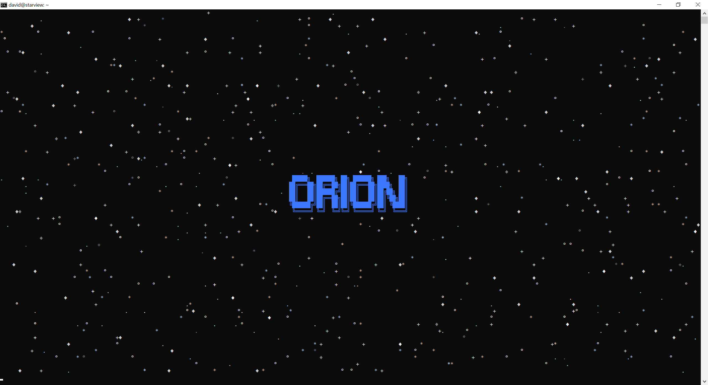

What is this you ask? ORION is a continuation and modernisation of a [project](https://github.com/davidus-sk/orion) I did over 12 years ago. ORION is a simple imaging system which runs from danw to dusk, it captures images of the sky periodically, stacks them, and then looks for lines. Why you ask? Well, for fun of course. The idea is to create beutidul composite images of the sky and capture a meteor or two streaking through the skys. Space is fascinating and the night sky is a window through which we can observe it.

## Documentation
So you have decided to setup an ORION system yourself? Keep reading.

### Config file
The `conf/` directory contains a sample configuration file. Copy the `config.json.default` to `config.json`. By default the application is looking for this file to load up settings. Once you made the copy open the new file in your favorite text-based editor (e.g. `nano config.json`) and make changes as needed. At minimum you have to adjust your location by entering latitude and longitude in decimal format. If you have a GPS receiver in your 4G/LTE hat that the application supports, the coordinates will be picked up automatically and the JSON file is updated for you.

- **latitude** - The latitude of your ORION box \[*decimal*, default Moab, UT\]
- **longitude** - The longitude of you ORION box \[*decimal*, default Moab, UT\]
- **temp_image_dir** - Location of the temporarily (nightly) captured images which are later merged together \[*string*, default /tmp/images\]
- **final_image_dir** - Location where the final merged image should be saved \[*string*, default /tmp\]
- **imaging_interval** - Frequency of capturing images in seconds \[*int*, default 60\]
- **camera_shutter** - For how long should the camera be capturing the open sky in microseconds \[*int*, default 15000000\]
- **log_to_file** - Write status and error messages into a log file, not just the screen \[*bool*, default true\]
- **minutes_delay** - How many minutes to wait after the sunset to start collecting images and how many minutes before the sunrise to stop the collection \[*int*, default 65\]

### Switches
The `orion.py` main application accepts several command line arguments which override some default behavior.

- **-c \<file\>** or **--config \<file\>** - Supply alternate path to the JSON config file and do not use the default `conf/` directory one.
- **--no_splash** - Do not show the start up screen when running `orion.py`.

## Requirements
There are many ways to slice and dice this setup. You can build a simple system with Wi-Fi and PoE power, or you can have an offline solution that you manually harvest images from that requires nothign more than 5VDC in. What hardware you will need depends on you and how automated you want the system to be. Our prototype system runs off solar power, has a 4G/LTE hat, and is locatated in a very remote area of the world with limited physical access. Our goal was to make a self sufficient unit which can gather stacked images and send them to a centralized server. Your setup can be much simpler if you place the ORION system on the roof of your house with good access to your Wi-Fi. Below are the most basic requirements needed for a home Wi-Fi setup.

### Hardware
- Raspberry Pi 0 2W, 4, or 5
- Pi Camera module with ribbon cable
- SG90 servo
- Enclosure
- Glass cover
- Water tight connector for power

### System

- lighttpd

### Python
Please see the [requirements.txt](./requirements.txt) file for needed modules. After you create your virtual environment, run this command: `pip install -r requirements.txt`

### Our Prototype
- [x] SBC [Pi 0 2W, 4, 5]
- [ ] GPS coords [4G/LTE hat]
- [x] Cell modem [4G/LTE hat]
- [x] servo iris control [Pi GPIO/PWM]
- [x] image acquisition [Pi camera module]
- [x] stacking [software]
- [ ] object/line detection [software]
- [ ] solar power input [charge controller]
- [ ] run on battery power [charge controller + 5000mAh LiPo]
- [ ] PoE input [hat]
- [ ] enclosure
- [ ] glass cover
- [x] led indicator
